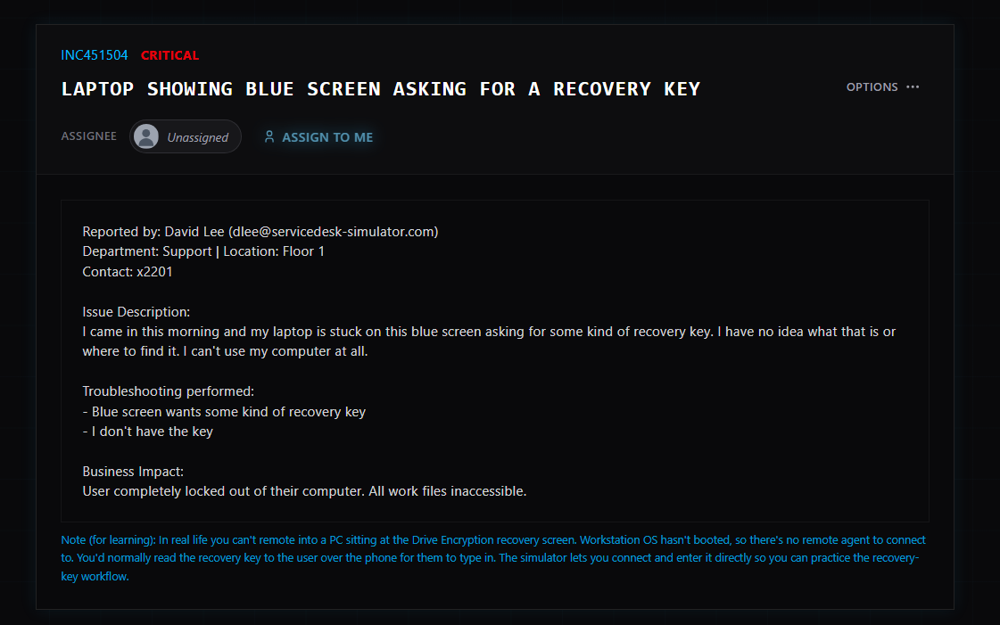
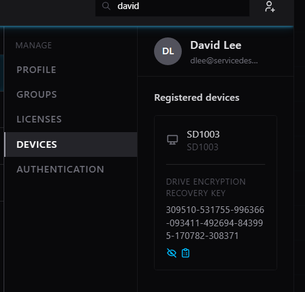
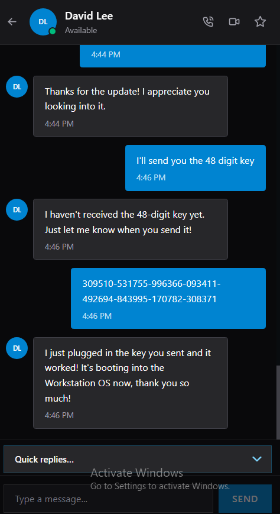

# Ticket 02 – BitLocker Recovery Recovery

## 📌 Scenario
A user reported that their laptop displayed a BitLocker recovery screen after arriving at work. They were unable to access Windows because the device requested a 48-digit recovery key.

---

## 🏢 Environment
- Operating System: Windows 10
- User: David Lee
- Department: Support
- Location: Floor 1

---

## 🎯 Business Impact
The user was completely locked out of the laptop and unable to access work files, preventing them from performing their daily tasks.

---

## 🔍 Troubleshooting Performed
- Verified the user's identity.
- Confirmed the device was displaying the BitLocker Recovery screen.
- Retrieved the BitLocker Recovery Key from Active Directory.
- Entered the 48-digit recovery key.
- Confirmed Windows booted successfully.
- Investigated possible causes of the recovery prompt.

---

## 🧠 Root Cause
BitLocker detected a change in the trusted boot environment. The TPM refused to automatically release the encryption key, requiring the recovery key to unlock the drive.

---

## ✅ Resolution
The recovery key was retrieved from Active Directory, entered successfully, and the device booted normally.

---

## 💡 Skills Demonstrated
- Active Directory
- BitLocker Administration
- Windows Security
- User Identity Verification
- Windows Troubleshooting
- Help Desk Support

---

## 📸 Screenshots

### Ticket

### Active Directory

### Recovery Screen
